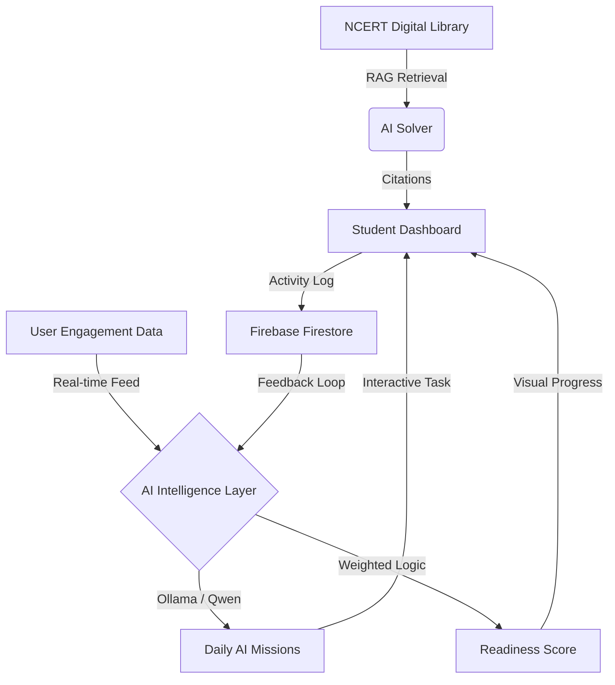

# 🎓 NCERT AI Solver: The Intelligence-Native Mastery Platform

An advanced, premium-styled academic assistant powered by **Ollama (Qwen 2.5/3)** and a **Retrieval-Augmented Generation (RAG)** pipeline. This project transforms passive reading into an interactive, AI-driven learning experience powered by a local intelligence layer.


---

## 🌟 The Evolution: From "Solver" to "Coach"

The **NCERT AI Solver** has evolved. While it started as a tool to answer textbook questions, it is now an **Academic Coach**. It doesn't just clear doubts; it analyzes your learning patterns to set daily missions, tracks your commitment, and visualizes your path to mastery.

---

## 💡 The "Intelligence Layer" Architecture

Our architecture is now **LLM-Native**, using a sophisticated agentic loop to personalize every interaction.



---

## ✨ Premium Features

### 🎯 **The Daily AI Mission**
Using **Ollama (Qwen)**, the app analyzes your subject mastery scores every morning. If your Science score is low, the AI creates a dedicated mission: *"Mission: Master Thermodynamics"* with real XP rewards.

### 🧠 **Intelligent Readiness Score**
A transparent, multi-dimensional metric that calculates your exam readiness based on:
- **Foundational Mastery** (Base 60%)
- **Lesson Completion** (+5% per module)
- **Active Engagement** (+1% per doubt solved)
- **Diagnostic Validation** (+2% per quiz score)

### ✅ **Diagnostic Hub (Assess)**
Move beyond just reading. Generate instant:
- **AI Flashcards**: For rapid-fire revision of complex terms.
- **Interactive Quizzes**: Multiple-choice assessments generated directly from textbook context with instant scoring.

### 🏠 **Personalized Home Hub**
- **Study Personas**: Identify as an *Architect*, *Sprinter*, or *Analyst* with custom UI branding.
- **Radial Commitment Tracker**: Visualize your daily study minutes against your set goals.
- **Subject Mastery Grid**: High-fidelity cards with glowing progress bars and descriptive icons for every subject.

---

## 🛠️ Tech Stack

- **Frontend**: React 18 (Vite), Framer Motion (High-Fidelity Animations), Tailwind CSS v4.
- **Backend**: FastAPI (Python), LangChain (Agentic Orchestration).
- **Primary Intelligence**: Ollama (Local LLM: Qwen 2.5 / Qwen 3).
- **Fallback Intelligence**: Google Gemini 1.5 Pro.
- **Storage/Auth**: Firebase Firestore & Authentication.
- **Vector Engine**: Semantic Indexing for NCERT textbooks.

---

## 🚀 Setup & Launch

### 1. Requirements
- **Ollama** installed and running (`ollama serve`).
- **Python 3.10+** and **Node.js 18+**.

### 2. Backend Orchestration
```bash
git clone https://github.com/yourusername/ncert-solver.git
cd ncert-solver
pip install -r requirements.txt
cp .env.example .env 
# Set OLLAMA_MODEL=qwen2.5 (or preferred model)
python src/api/main.py
```

### 3. Frontend Experience
```bash
cd src/ui
npm install
npm run dev
```

---

## 📜 Project Vision
To bridge the "Doubt Gap" in Indian education by providing every student—regardless of location—with an elite, AI-driven study partner that understands the NCERT curriculum as perfectly as a teacher, but with the 24/7 availability of an app.

*Educational Project. All NCERT contents are properties of NCERT India.*
