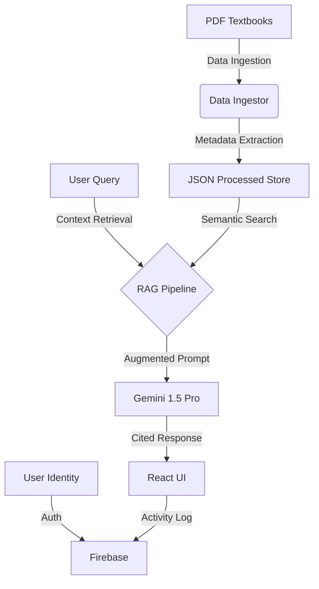

# 🎓 NCERT AI Solver: Intelligent Study Companion

An advanced, premium-styled academic assistant powered by **Google Gemini 1.5 Pro** and a **Retrieval-Augmented Generation (RAG)** pipeline. This project transforms passive reading into an interactive, data-driven learning experience for students across India.


---

## 🌟 Why This Project? (The Requirement)

In the current education landscape, students often face a **"Doubt Gap"**—the time between encountering a complex concept in a textbook and receiving a clear explanation. While NCERT textbooks are foundational for millions, they can be dense. Students in remote areas or those without access to 24/7 private tutoring often struggle to bridge this gap alone.

**NCERT AI Solver** was built to provide every student with a 1-on-1, high-fidelity tutor that knows their textbook inside out.

---

## 🔍 The Cause & Root Problem

Digital education has historically suffered from three major flaws:
1. **Generic Intelligence**: Standard AI often gives "hallucinated" or out-of-syllabus answers that don't align with the specific NCERT curriculum.
2. **Passive Consumption**: Reading PDFs is static; students cannot "ask" a textbook for clarification.
3. **Lack of Personalization**: Most platforms don't track *what* a student is struggling with, making it hard to identify weak areas until the exam day.

---

## 💡 The Solution: AI-Driven Contextual Learning

Our system addresses these roots by integrating three core pillars:
- **RAG Architecture**: We don't just use AI; we feed the AI the *exact* NCERT PDF content. This ensures answers are 100% accurate, syllabus-aligned, and include page citations.
- **Multilingual Support**: Education shouldn't be barred by language. Our solver understands and responds in major Indian regional languages.
- **Personalized Feedback Loop**: Integrated with **Firebase Authentication**, we log every doubt asked and lesson started to build a real-time "Readiness Score" for the student.

---

## 🚀 Key Benefits

- **Instant Clarity**: No more waiting for the next class; get doubts cleared at midnight.
- **Syllabus Accuracy**: Every response is grounded in the NCERT text, preventing confusion from generic web searches.
- **Data-Driven Confidence**: The Bento-style Dashboard shows students exactly where they stand in their learning journey.
- **Accessibility**: A premium, high-end UI designed for focus, making study time feel modern and engaging.

---

## 🏗️ System Architecture

Our architecture is designed for **deterministic accuracy**. Unlike standard AI that relies on memory, NCERT AI uses a "Closed-Book with Reference" approach (RAG).



### 🛠️ The RAG Flow (Step-by-Step)

1.  **Ingestion Phase**: Textbooks are parsed and chunked. Each chunk is tagged with `grade`, `subject`, and `filename`.
2.  **Retrieval Phase**: When you ask a doubt about "Photosynthesis", the system searches the *Class 10 Science* JSON files for the most relevant paragraphs.
3.  **Augmentation Phase**: We don't just send your question to Gemini. We send: *"Using ONLY this text from NCERT Class 10 Science, answer the user: [Context Snippet]"*.
4.  **Generation Phase**: Gemini generates a response that is strictly grounded in the textbook.

---

## ⚖️ Side-by-Side Comparison

| Feature | Standard LLM (Generic) | NCERT AI Solver (RAG) |
| :--- | :--- | :--- |
| **Source of Truth** | Training Data (Internal) | Actual NCERT Textbook (External) |
| **Accuracy** | Prone to Hallucinations | 100% Syllabus Aligned |
| **Citations** | None (Trust me bro) | Specific Chapter & Page References |
| **Example Query** | *"Explain rusting"* | *"Explain rusting as per Class 10 Science"* |
| **Result** | Explains it generally. | Explains the exact chemical reaction and experiment mentioned on Page 34. |

---

## ✨ Features

### 🧠 Intelligent Doubt Solver
- **Contextual Learning**: Select a chapter to focus the AI's intelligence solely on that lesson.
- **Dynamic Citations**: AI responses include direct references to textbook chapters.
- **Multilingual AI**: Fluently handles queries in English, Hindi, and beyond.

### 📚 Digital Archives (Library)
- **Multi-Grade Support**: Selection for Classes 5-10 with a sleek, interactive UI.
- **Automatic Ingestion**: High-precision PDF processing for instant availability.

### 📊 Real-time Dashboard
- **student Mastery**: Tracks "Overall Readiness" using Firebase progress logs.
- **Activity Feed**: Real-time history of your learning milestones.

---

## 🛠️ Tech Stack

- **Frontend**: React 18, Vite, Framer Motion (Animations), Tailwind CSS v4.
- **Backend**: FastAPI (Python), LangChain (RAG Pipeline).
- **Intelligence**: Google Gemini Pro 1.5.
- **Infrastructure**: Firebase (Auth & Firestore Analytics).

---

## 🚀 Getting Started

### 1. Backend Setup
```bash
git clone https://github.com/yourusername/ncert-solver.git
cd ncert-solver
pip install -r requirements.txt
cp .env.example .env # Add your GOOGLE_API_KEY
python src/api/main.py
```

### 2. Frontend Setup
```bash
cd src/ui
npm install
cp .env.example .env.local # Add Firebase Credentials
npm run dev
```

---

## 📁 Project Structure

```text
├── src/
│   ├── api/          # FastAPI Backend Endpoints
│   ├── rag/          # Gemini RAG Pipeline logic
│   ├── ingestion/    # PDF Processing Engine
│   └── ui/           # React + Tailwind Dashboard
├── data/
│   ├── raw/          # Original Textbook PDFs
│   └── processed/    # Context-ready JSON extracts
└── database/         # Local vector store (FAISS/Chroma)
```

## 📜 License
Educational Project. All NCERT contents are properties of NCERT India.
